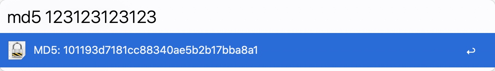

适配 Alfred 4 的哈希计算器 
============

~~抄作业~~ 适配了 PHP8 并汉化

安装
----------------

- 下载 "[Hash.alfredworkflow](https://github.com/X1A0CA1/alfred4-hash/raw/master/hash.alfredworkflow)" 
- 双击打开，并安装

用法
----------------

- md5 `<string>`
- sha1 `<string>`
- sha256 `<string>`
- sha512 `<string>`
- htpasswd `<string>`
- crc32 `<string>`
- whirlpool `<string>`
- base64_decode `<string>`
- base64_encode `<string>`

### 文件 hash

* 先在 Fidder 中选中你需要计算 hash 的文件，然后输入以下命令其中之一：

  - md5f
  - sha1f
  - sha256f
  - sha512f
  - base64f

